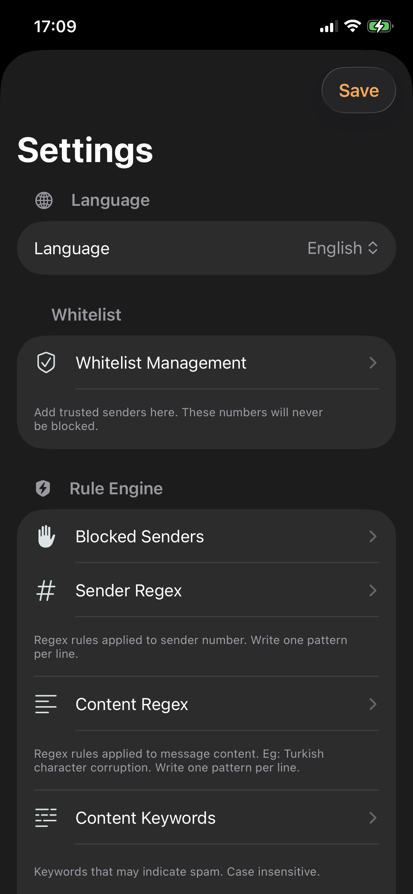
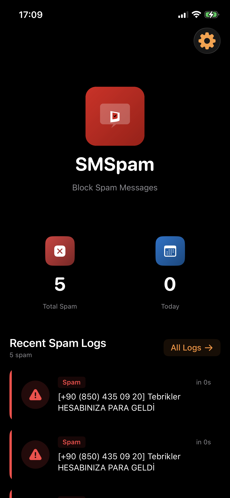

# SMSpam - iOS SMS Spam Blocker

A powerful iOS application that automatically detects and blocks spam SMS messages using customizable rules and regex patterns. Keep your inbox clean and protected from unwanted messages.


## Support

If SMSpam is useful to you, consider supporting its development:

[](https://github.com/sponsors/tubekinan)
[](https://buymeacoffee.com/tubekinan)

Your support helps keep this project alive and improving!

## Screenshots

| Home Screen | Settings |
|:-----------:|:--------:|
|  |  |

## About

SMSpam analyzes incoming SMS messages on your device and identifies spam using multiple detection methods including keyword filtering, regex patterns, sender analysis, and short URL detection. All processing happens locally on your device - no data is sent to external servers.

## Features

### Core Features
- **Automatic Spam Detection** - Real-time analysis of SMS messages
- **Whitelist Management** - Add trusted contacts that will never be blocked
- **Custom Regex Rules** - Create powerful patterns to match spam content
- **Keyword Filtering** - Block messages containing specific words
- **Short URL Detection** - Identify suspicious shortened URLs
- **Spam Logging** - Track blocked messages with detailed information

### Spam Categories
- **Banking Scams** - Fake banking and financial fraud
- **Gambling Promotions** - Casino and betting spam
- **Suspicious Links** - Messages with shortened URLs
- **General Spam** - Other unwanted content

### Additional Features
- **7 Languages** - Turkish, English, German, French, Spanish, Chinese, Japanese
- **Modern UI** - Native iOS design with SwiftUI
- **Light/Dark Mode** - Automatic theme support
- **Privacy First** - All processing happens on-device

## Installation

### Requirements
- iOS 16.0 or later
- Xcode 15.0 or later
- Swift 5.9

### Steps

1. **Clone the repository**
```bash
git clone https://github.com/tubekinan/SMSpam.git
```

2. **Open in Xcode**
```bash
cd SMSpam
open SMSpam.xcodeproj
```

3. **Configure signing**
   - Select the SMSpam target
   - Go to "Signing & Capabilities"
   - Select your development team
   - Enable "Automatic signing"

4. **Build and run**
   - Select your target device or simulator
   - Press `Cmd + R` to build and run

## Usage

### Home Screen
The home screen displays:
- App logo and name
- Total spam count
- Today's spam count
- Recent spam logs (last 5)
- Filter by spam type

### Settings
Access settings from the gear icon:

#### Language
Switch between 7 supported languages:
- Turkish (Türkçe)
- English
- German (Deutsch)
- French (Français)
- Spanish (Español)
- Chinese (中文)
- Japanese (日本語)

#### Whitelist
Add trusted phone numbers or patterns:
- Sender contains text
- Sender regex patterns

#### Rule Engine
Customize spam detection:
- **Blocked Senders** - Phone numbers or text to block
- **Sender Regex** - Patterns for sender matching
- **Content Regex** - Patterns for message body matching
- **Keywords** - Words that indicate spam
- **Short URL Patterns** - Shortened URL domains to block

#### Log Settings
- Maximum spam log entries (default: 200)
- Older logs are automatically deleted

## Default Spam Rules

### Blocked Senders
Common Turkish bank names and spam senders:
- akbank, isbank, isbankasi, finansbank, fibabanka

### Spam Patterns
- Turkish spam number format: `(\+90[\s\-]?\(?850\)?|0850|90850)`
- Corrupted Turkish text: `[A-Z]+i[A-Z]+`

### Gambling Keywords
- bonus, freespins, freebet, jackpot, slot, çekim, bahis, yatırım

### Short URL Domains
- t2m.io, bit.ly, tinyurl.com, goo.gl, ow.ly, rb.gy, cutt.ly

## Architecture

```
SMSpam/
├── SMSpam/
│   ├── ContentView.swift      # Main UI components
│   ├── LanguageManager.swift  # Localization handling
│   ├── SMSpamApp.swift        # App entry point
│   ├── Assets.xcassets/       # Icons and images
│   ├── de.lproj/             # German translations
│   ├── en.lproj/             # English translations
│   ├── es.lproj/             # Spanish translations
│   ├── fr.lproj/             # French translations
│   ├── ja.lproj/             # Japanese translations
│   ├── tr.lproj/             # Turkish translations
│   └── zh-Hans.lproj/        # Chinese translations
├── SpamFilterExtension/       # Message filtering extension
└── SMSpam.xcodeproj/         # Xcode project file
```

## Localization

To add a new language:

1. Create a new `.lproj` folder (e.g., `pt.lproj`)
2. Copy `Localizable.strings` from an existing language
3. Translate all key-value pairs
4. Add the language to `LanguageManager.swift`:
```swift
("pt", "Portuguese", "Português")
```

## Privacy

SMSpam processes all messages locally on your device. No personal data is sent to external servers. All analysis happens on-device to protect your privacy.

## Contributing

Contributions are welcome! Please feel free to submit a Pull Request.

1. Fork the repository
2. Create your feature branch (`git checkout -b feature/AmazingFeature`)
3. Commit your changes (`git commit -m 'Add AmazingFeature'`)
4. Push to the branch (`git push origin feature/AmazingFeature`)
5. Open a Pull Request

## License

This project is licensed under the MIT License - see the [LICENSE](LICENSE) file for details.

## Contact

- GitHub: [@tubekinan](https://github.com/tubekinan)
- Project: [https://github.com/tubekinan/SMSpam](https://github.com/tubekinan/SMSpam)

## Acknowledgments

- SwiftUI for the modern UI framework
- Apple Message Filter Extension API
- All contributors and translators
